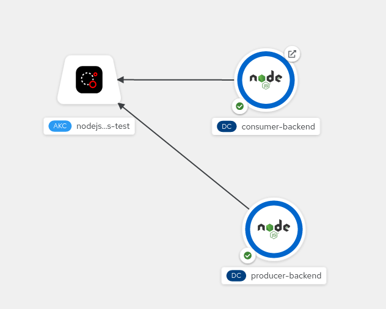

# reactive-example


This is a basic end-to-end app that demonstrates publishing and subscribing to Kafka.

While it's possible to write the consumer and producer in a single node.js project for demonstration purposes, we've decided to split it into three parts (not in monorepo form) to take advantage of the microservices architecture and deployment in Openshift to get closer to the four principles of reactive systems described in the 
[reactive manifesto](https://www.reactivemanifesto.org/).

Also a good suggestion to read item `5. Reactive programming != Reactive system` of the article [5 Things to Know About Reactive Programming](https://developers.redhat.com/blog/2017/06/30/5-things-to-know-about-reactive-programming)

The example is composed by:

- A standalone producer app (producer-backend)
- An Express-Websocket server (consumer-backend)
- A front-end app to connect to consumer's Websocket server to display the messages

> The example is intended to be deployed and run in an Openshift or [CodeReady containers](https://developers.redhat.com/products/codeready-containers/overview) with [Kafka operator](https://strimzi.io/quickstarts/) installed. (Although it is possible to run on a common kafka installation.)

## Setup Kafka Operator

Installing the Kafka Operator using the Web Console of Openshift is pretty straightforward.  A more visual guide is provided [here](./KAFKA_OPERATOR_SETUP.md)

First, go to the *Operator Hub* and search for *Kafka*.  A few choices might show up,  but we want the one that says "Strimzi" which is the community Kafka version.

Since we just want the defaults, we can just click *install* on the next 2 screens.  Then wait until the operator is ready.

Next, create a new project.  I used nodejs-examples, but it can be anything.  This can either be done on the command line with the `oc` client, or in the web console.  I tend to do this step in the console.

```
$ oc new-project nodejs-examples
```

The last step of the setup, is to create a new Kafka instance.  This can be done from the web console also.  Navigate to the installed operators and click on the kafka one that was just installed.

Before clicking on the *Create Instance* link under the Kafka tab, make sure your "current project namespace" is the one you just created.  Once that is set, click the *Create Instance* link and just use the defaults, which should name the new cluster `my-cluster`

## Deploy the Applications

Both producer and consumer are using [node-rdkafka](https://github.com/Blizzard/node-rdkafka).

### producer-backend

The producer-backend is using the [`Producer` constructor](https://github.com/Blizzard/node-rdkafka#sending-messages) to
send messages to Kafka, which its content is a random country name.

If you used the defaults for the cluster naming, then nothing needs to change, but if you named the cluster something else, then you will need to change the server name in the code:

```
new Kafka.Producer({
  'bootstrap.servers': 'my-cluster-kafka-bootstrap:9092'
})
```

### consumer-backend

The consumer-backend is using the [`Consumer Stream API`](https://github.com/Blizzard/node-rdkafka#stream-api-1).

Similar to the producer backend,  if you named the cluster something other than `my-cluster` you will need to update the cluster name in the consumer code.

### front-end

The front-end part is a vue app that connects via WebSocket to the consumer back-end.

The example is using [nodeshift](https://github.com/nodeshift/nodeshift) to deploy the apps to Openshift.

### Running the example

```
cd producer-backend
npm run openshift

cd ../consumer-backend
npm run openshift

cd ../frontend
npm run openshift
```

### Node-rdkafka and KafkaJS

This (main) branch is using [node-rdkafka](https://github.com/Blizzard/node-rdkafka), which must be used with Node.js version < 16.x.

You can also try the [KafkaJS](https://github.com/tulios/kafkajs/) version:

```
git checkout kafkajs
```

### Working with Managed Kafka

Instead of installing a Kafka instance into your cluster you can also
use a managed Kafka instance like
[Red Hat OpenShift Streams for Apache Kafka (RHOSAK)](https://developers.redhat.com/products/red-hat-openshift-streams-for-apache-kafka/overview).
If you are deploying into OpenShift and using RHOSAK, the example is all
set up to use service bindings, and to connect your Kafka instance.
Provided you have installed the OpenShift Application Services and
Service Binding Operators and have configured them with your RHOSAK
information you can simply drag the arrow from the producer and consumer
on the OpenShift topoloy page onto icon for the Kafka instance.



This is possible due to the use of the
kube-service-bindings](https://github.com/nodeshift/kube-service-bindings)
package. In the code you'll see a call to:

```JavaScript
  kafkaConnectionBindings = serviceBindings.getBinding('KAFKA', 'node-rdkafka');
```

which will get the connection info from the bindings if it is available and
return it in the format required by the Kafka client.
